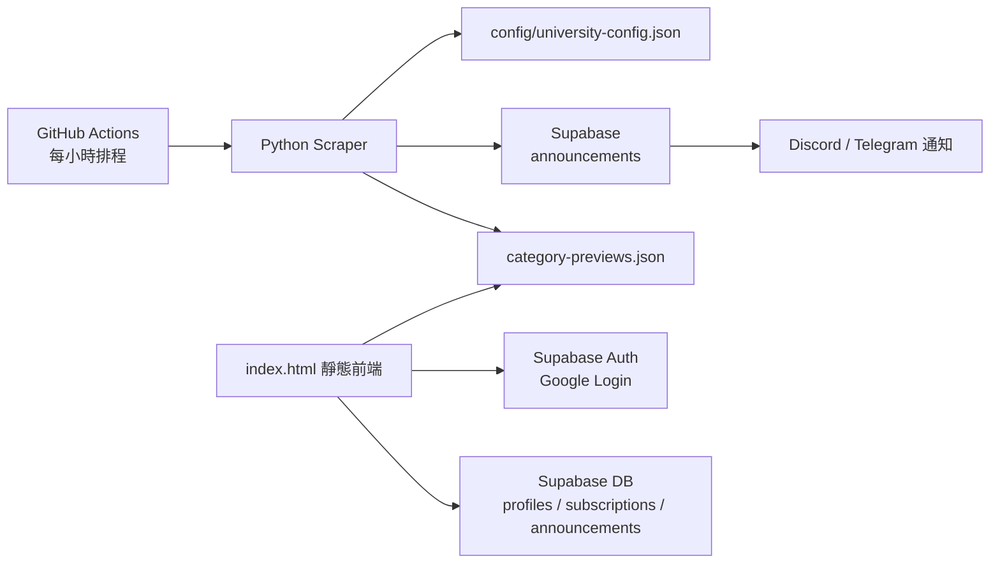

# UniSync

UniSync 是一個針對國立臺灣師範大學公告來源設計的公告同步與通知系統。專案目標是把分散在各學術單位、行政單位、研究中心網站上的公告整合起來，讓使用者可以依照「單位分類」或「全域關鍵字」訂閱，並在有新公告時透過 Discord 或 Telegram 收到通知。

這個專案目前包含：

- 靜態前端儀表板：Google 登入、公告來源選單、公告預覽、Live Feed、通知偏好設定。
- Python 爬蟲引擎：定時抓取各校網公告，解析日期、標題、連結、置頂公告與特殊網站格式。
- Supabase 後端：儲存使用者、訂閱偏好、公告資料與全域關鍵字。
- GitHub Actions 自動化：每小時執行爬蟲，寫入 Supabase，更新前端預覽快取。

## 專案特色

- 支援大量校內來源：目前設定檔包含 760 個公告分類、41 組 selector preset。
- 多層級訂閱選單：依行政組織、學術單位、學院、系所、中心與公告類型整理。
- 分類訂閱：使用者可以勾選自己關心的公告類別。
- 全域關鍵字雷達：使用者可以輸入關鍵字，未來只要新公告標題或來源命中就會通知。
- 公告預覽：前端會讀取 `category-previews.json`，不用每次打開頁面都查 Supabase。
- Live Feed：登入後顯示使用者訂閱與全域關鍵字命中的近期公告。
- 通知管道：目前支援 Discord Webhook 與 Telegram Bot。
- 去重處理：同一公告若出現在多個分類，會以 URL 正規化後合併處理。
- 置頂公告處理：針對部分網站的置頂公告避免誤判為最新公告。

## 系統架構



整體流程：

1. GitHub Actions 依排程執行 `src/main.py`。
2. `main.py` 讀取 `config/university-config.json` 中的公告來源設定。
3. `scraper.py` 根據每個分類的 selector 或特殊 parser 抓取公告。
4. 系統以公告 URL 判斷是否為新公告。
5. 新公告寫入 Supabase `announcements`。
6. 系統比對使用者的分類訂閱與全域關鍵字。
7. 若命中，透過 Discord 或 Telegram 發送通知。
8. 同步產生 `category-previews.json`，供前端公告預覽使用。

## 前端功能

前端入口是 `index.html`，搭配 `css/style.css` 與 `js/` 內的模組。

- `js/auth.js`：Supabase 初始化、Google 登入、使用者通知設定、訂閱儲存。
- `js/main.js`：訂閱選單、公告預覽、Live Feed、公告聚合顯示。
- `js/keywords.js`：全域關鍵字新增、刪除、預覽與同步。
- `js/menu-data.js`：載入 `config/university-config.json`，建立前端選單資料。

使用者登入後可以：

- 勾選公告分類。
- 儲存 Discord Webhook。
- 儲存 Telegram Bot Token 與 Chat ID。
- 新增全域關鍵字。
- 查看近期 Live Feed。
- 點擊眼睛圖示預覽各分類近期公告。

## 後端與資料庫

後端主要使用 Supabase，核心資料表包含：

- `profiles`：使用者通知設定與全域關鍵字。
- `user_subscriptions`：使用者訂閱的分類。
- `announcements`：爬蟲同步後的公告資料。

資料庫索引、RLS policy 與 Live Feed RPC 可以參考：

- `sql/migration.sql`

GitHub Actions 執行爬蟲時需要使用 Supabase service role key，請放在 GitHub Repository Secrets：

- `SUPABASE_URL`
- `SUPABASE_KEY`

前端使用的是 Supabase publishable/anon key，可以公開放在靜態頁中；資料安全主要依靠 Supabase RLS policy 控制。

## 爬蟲設定

公告來源集中管理在：

- `config/university-config.json`

設定檔主要分成：

- `schema`：前端訂閱選單的階層結構。
- `categories`：每個公告分類的實際 URL、owner、label 與爬取設定。
- `selectorPresets`：可重複使用的 selector/parser 設定。

新增公告來源時，通常只需要：

1. 在 `categories` 新增分類設定。
2. 在 `schema` 中把分類放到對應單位底下。
3. 若網站格式特殊，新增或調整 `selectors.parser`。
4. 執行設定檢查。

更完整的維護規則請看：

- `CONFIG_MAINTENANCE.md`

## 本機開發

### 1. 安裝 Python 依賴

```powershell
python -m venv .venv
.\.venv\Scripts\Activate.ps1
pip install -r requirements.txt
```

### 2. 建立環境變數

在專案根目錄建立 `.env`：

```env
SUPABASE_URL=你的 Supabase URL
SUPABASE_KEY=你的 Supabase service role key
```

### 3. 驗證設定檔

```powershell
python scripts\validate_config.py
```

### 4. 執行爬蟲同步

```powershell
python src\main.py
```

### 5. 啟動前端

前端是靜態頁，可以用 VS Code Live Server 或任一靜態伺服器開啟 `index.html`。

若要讓 Google 登入在正式網址可用，請到 Supabase Dashboard 設定：

- Authentication > URL Configuration > Site URL
- Authentication > URL Configuration > Redirect URLs

把正式部署網址加入允許清單。

## GitHub Actions

自動排程位於：

- `.github/workflows/scrape.yml`

目前設定：

- 每小時執行一次。
- 執行 `scripts/validate_config.py`。
- 執行 `python src/main.py`。
- 如果 `category-previews.json` 有更新，會自動 commit 並 push。
- 預覽快取 commit 使用 `[skip ci]`，避免更新快取又再次觸發 CI。

## 通知邏輯

新公告通知會由兩種條件觸發：

- 分類訂閱：公告所屬分類符合使用者勾選的分類。
- 全域關鍵字：公告標題、來源或分類標籤包含使用者設定的關鍵字。

同一則公告如果同時符合多個分類或多個關鍵字，系統會盡量合併顯示，避免使用者收到重複通知。

目前支援：

- Discord Webhook
- Telegram Bot API

尚未完成：

- Email 通知
- RSS 輸出

## 專案結構

```text
UniSync/
├── .github/workflows/scrape.yml      # GitHub Actions 自動爬蟲
├── config/university-config.json     # 公告來源與前端選單設定
├── css/style.css                     # 前端樣式
├── js/auth.js                        # 登入、通知偏好、訂閱同步
├── js/keywords.js                    # 全域關鍵字管理
├── js/main.js                        # 選單、預覽、Live Feed
├── js/menu-data.js                   # 載入選單設定
├── scripts/validate_config.py        # 設定檔驗證
├── scripts/test_telegram_notification.py
├── sql/migration.sql                 # Supabase schema / RLS / RPC
├── src/main.py                       # 爬蟲同步入口
├── src/scraper.py                    # 公告解析器
├── src/notifier.py                   # Discord / Telegram 通知
├── src/announcement_repository.py    # Supabase announcement 寫入與查詢
├── src/announcement_identity.py      # 公告 URL 正規化與去重
├── src/preview_writer.py             # 預覽快取輸出
├── category-previews.json            # 前端公告預覽快取
└── index.html                        # 前端入口
```

## 已知限制

- 各單位網站格式不一致，部分來源需要客製 parser。
- 有些網站顯示的是活動日期而非發布日期，可能不適合作為公告通知來源。
- 有些校內網站連線較慢或 SSL 設定較舊，GitHub runner 可能比本機更容易 timeout。
- 目前 GitHub Actions 仍需要在大量來源下控制執行時間。
- 前端是靜態頁，敏感操作依賴 Supabase RLS 與 service role key 分離。

## 未來可擴充方向

- 將爬蟲分批執行，降低單次 GitHub Actions 負擔。
- 增加 Email 通知。
- 提供 RSS feed。
- 在後台顯示各來源健康狀態與最近爬取時間。
- 把特殊 parser 再模組化，降低 `scraper.py` 長度。
- 增加使用者端通知測試按鈕。
- 補上更多單元測試與整合測試。

## 專案定位

UniSync 不是單純的爬蟲練習，而是一個把「資料擷取、資料庫、登入權限、通知推播、前端體驗、自動化部署」串在一起的校園資訊同步工具。它的核心價值是降低使用者追公告的成本，讓公告從「需要每天自己去找」變成「有重要更新時主動通知」。
